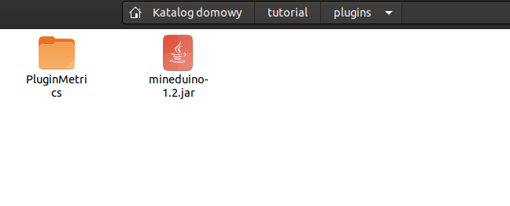

# Install the plugin

## Install the plugin

First of all you need to download the latest version of the plugin from here \(mineduino-x.x.x.jar\):



Put this file into the /plugins folder

Now, restart the server, and you should encounter something like this in the logs:

