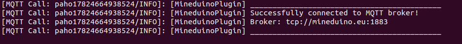

# Install the plugin

## Install the plugin

First of all you need to download the latest version of the plugin from here \(mineduino-x.x.x.jar\):



Put this file into the /plugins folder


Now, restart the server, and you should encounter something like this in the logs:



That indicates, that mineduino is connected, and fully works!

Now you can edit config in plugins/mineduino/config.json

```text
{
  "broker_login_password": "password",
  "broker_login_username": "username",
  "broker": "tcp://mineduino.eu:1883",
  "version": 1.1
}

```

Do not change version, other things are self-explainatory

